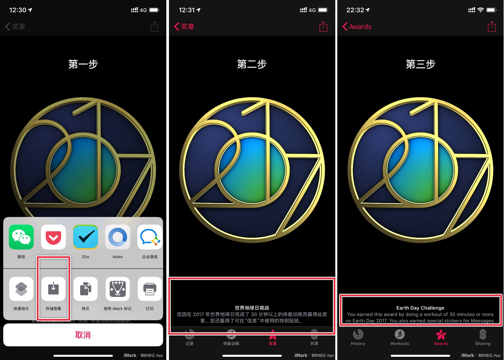

### 贡献奖章

您可以贡献出自己已获取但网站未涵盖的奖章，为我们收集全部的 Apple Watch 奖章出一份力。

贡献自己的奖章需要提供以下三部分内容：

1. 健身记录应用 → 奖章 → 默认正视图 → 保存奖章图片。【用于展示奖章图像】
2. 健身记录应用 → 奖章 → 默认正视图 → 截取包含底部全部介绍信息。【用于介绍奖章含义】
2. 系统语言设置为英文 → 该奖章官方英文名称及介绍信息。【用于对奖章文件进行命名】

最后，请将每个奖章包含的 3 张截图存放在一个文件夹中，使用 `zip` 压缩后发送至邮箱 huhuhang#谷歌邮箱.com。请备注自己的微博 ID 或者 GitHub ID，我们会将您添加至贡献者名单。

当然，如果您熟悉 Github，也可以按照仓库格式直接提 Pull Requests。

---

### 贡献者

- [huhuhang](https://weibo.com/338363939) 贡献最初奖章。
- [Hulk孙亮](https://weibo.com/2034468245) 贡献了多个限量版奖章。
- [Fawen](https://weibo.com/GFawen) 贡献了两个竞赛奖章。
